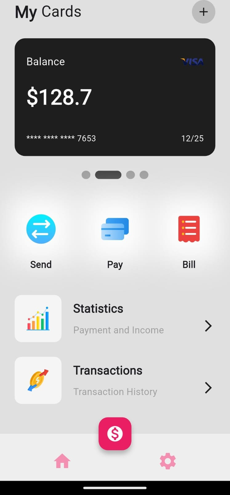
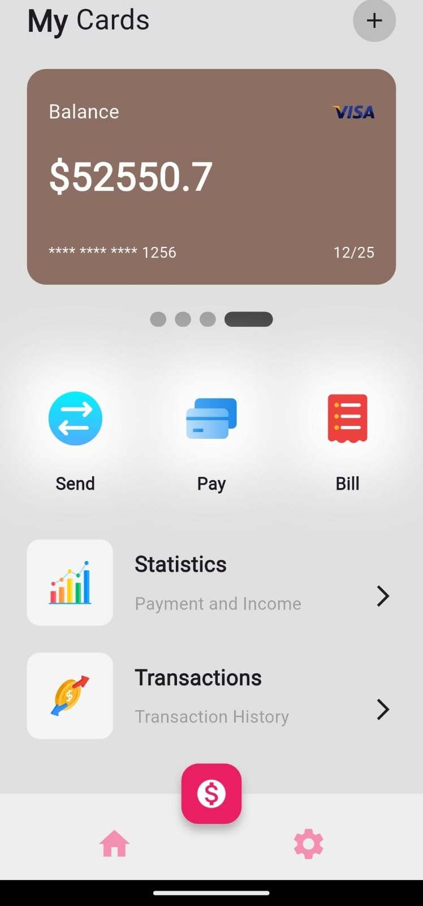

# 🔌 Wallet App

A sleek and simple Flutter-based Wallet application.

---

## 📱 Features


- 🎨 Beautiful UI with custom icons
- 📋 Modular code with reusable widgets

---

## 🖼️ Screenshots

## 🖼️ Screenshots

<p align="center">
  
  
  
</p>


---

## 🚀 Getting Started

1. **Clone the repository:**
   ```bash
   git clone https://github.com/varshithcgowdary/wallet.git
   cd smarthome
   ```
